<h1 align="center">Grounding DINO 1.5</h2>

<div align=center>

  **IDEA Research's Most Capable Open-World Object Detection Model Series.** 

  The project provides **examples** for using the models, which are hosted on [DeepDataSpace](https://deepdataspace.com/home).

  **[IDEA-CVR, IDEA-Research](https://github.com/IDEA-Research)** 

</div>

<div align=center>

[](https://arxiv.org/abs/2405.10300)   [](https://deepdataspace.com/home) [](https://hits.seeyoufarm.com) [](https://deepdataspace.com/playground/grounding_dino)
</div>

✨ **First-Time Application**: If you are interested in our project and wish to try our algorithm, you will need to apply for the corresponding API Token through our [request API token website](https://cloud.deepdataspace.com/apply-token?from=github) for your first attempt.

📌 **Request Additional Token Quotas**: If you find our project helpful and need more API token quotas, you can request additional tokens by [filling out this form](https://docs.google.com/forms/d/e/1FAIpQLSfjogAtkgoVyFX9wvCAE15mD7QtHdKdKOrVmcE5GT1xu-03Aw/viewform?usp=sf_link). Our team will review your request and allocate more tokens for your use in one or two days. You can also apply for more tokens by sending us an email.

🔥 **Grounding DINO 1.6 Release**: Grounding DINO 1.6 Pro establishes new SOTA results on zero-shot transfer benchmarks: **55.4 AP** on COCO , **57.7 AP** on LVIS-minival, and **51.1 AP** on LVIS-val. Moreover, it demonstrates significantly superior performance compared with the 1.5 Pro model in several specific detection scenarios, such as **Animal Detection**, **Text Detection**, etc. Please refer to our [Official Blog](https://www.deepdataspace.com/blog/Grounding-DINO-1.6-Pro) for more details about the 1.6 release.

<!-- [](https://github.com/Mountchicken/MMOCR_tutorials/assets/65173622/1adb50af-8ebf-4e9c-aa45-b96267ea6622) -->

[](https://github.com/user-attachments/assets/d19d8698-9f2c-41f8-9803-110b3cab23cf)

## Contents
- [Contents](#contents)
- [Introduction](#introduction)
- [Model Framework](#model-framework)
- [Performance](#performance)
  - [Side-by-Side Performance Comparison with Grounding DINO](#side-by-side-performance-comparison-with-grounding-dino)
  - [Zero-Shot Transfer Results of Grounding DINO 1.5 & 1.6 Pro](#zero-shot-transfer-results-of-grounding-dino-15--16-pro)
  - [Few-Shot Transfer Results of Grounding DINO 1.5 Pro](#grounding-dino-15-as-a-strong-few-shot-learner)
  - [Fine-tuning Results on Downstream Datasets](#fine-tuning-results-on-downstream-datasets)
- [API Usage](#api-usage)
  - [1. Installation](#1-installation)
  - [2. Request API from DeepDataSpace](#2-request-api-from-deepdataspace)
  - [3. Runing demo code](#3-runing-demo-code)
  - [4. Online Grdio demo](#4-online-grdio-demo)
- [Case Analysis and Qualitative Visualization](#case-analysis-and-qualitative-visualization)
- [Related Work](#related-work)
- [LICENSE](#license)
- [BibTeX](#bibtex)

## Introduction

We introduce Grounding DINO 1.5, a suite of advanced open-set object detection models developed by [IDEA Research](https://github.com/IDEA-Research), which aims to advanced the "Edge" of open-set object detection. The suite encompasses two models:

- **Grounding DINO 1.5 Pro:** Our most **capable** model for open-set object detection, which is designed for stronger generalization capability across a wide range of scenarios.

- **Grounding DINO 1.5 Edge:** Our most **efficient** model for edge computing scenarios, which is optimized for faster speed demanded in many applications requiring edge deployment.

<p align="left"><em>Note: We use "edge" for its dual meaning both as in <b>pushing the boundaries</b> and as in <b>running on edge devices</b>.</em></p>


## Model Framework

The overall framework of Grounding DINO 1.5 is as the following image:

<div align="center">
  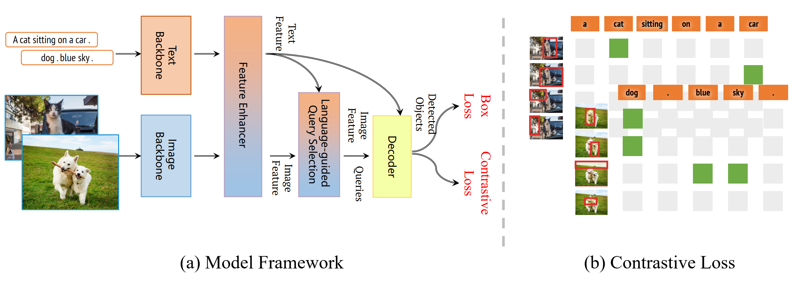
</div>

Grounding DINO 1.5 Pro preserves the core architecture of Grounding DINO which employs a deep early fusion architecture.

## Performance

### Side-by-Side Performance Comparison with Grounding DINO

<div align="center">
  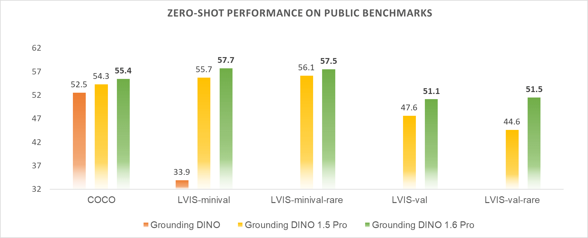
</div>

<details close>
<summary> <b> Grounding DINO 1.5 Pro vs Grounding DINO </b> </summary>

<div align="center">
  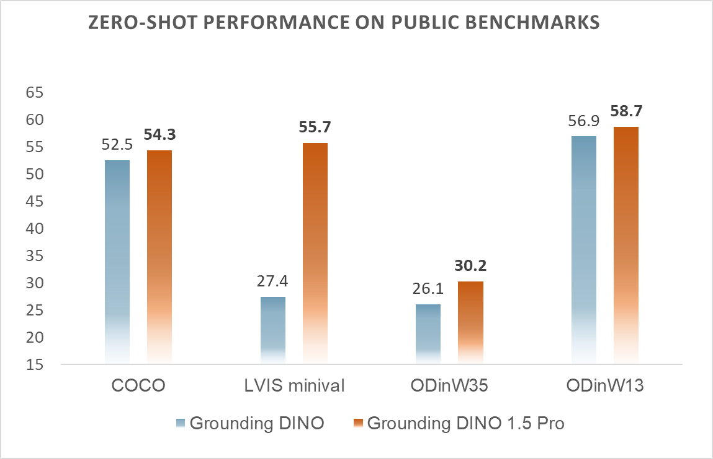
</div>

</details>

### Zero-Shot Transfer Results of Grounding DINO 1.5 & 1.6 Pro

<table align="center">
<thead>
  <tr>
    <th>Model</th>
    <th>COCO <br><sup><sup>(AP box)</sup></sup></th>
    <th>LVIS-minival <br><sup><sup>(AP all)</sup></sup></th>
    <th>LVIS-minival <br><sup><sup>(AP rare)</sup></sup></th>
    <th>LVIS-val <br><sup><sup>(AP all)</sup></sup></th>
    <th>LVIS-val <br><sup><sup>(AP rare)</sup></sup></th>
    <th>ODinW35 <br><sup><sup>(AP avg)</sup></sup></th>
    <th>ODinW13 <br><sup><sup>(AP avg)</sup></sup></th>
  </tr>
</thead>
<tbody align="center">
  <tr>
    <td>Other Best<br>Open-Set Model</td>
    <td>53.4<br><sup><sup>(OmDet-Turbo)</sup></sup></td>
    <td>47.6<br><sup><sup>(T-Rex2 visual)</sup></sup></td>
    <td>45.4<br><sup><sup>(T-Rex2 visual)</sup></sup></td>
    <td>45.3<br><sup><sup>(T-Rex2 visual)</sup></sup></td>
    <td>43.8<br><sup><sup>(T-Rex2 visual)</sup></sup></td>
    <td>30.1<br><sup><sup>(OmDet-Turbo)</sup></sup></td>
    <td><b>59.8</b><br><sup><sup>(APE-B)</sup></sup></td>
  </tr>
  <tr>
    <td>DetCLIPv3</td>
    <td> - </td>
    <td>48.8</td>
    <td>49.9</td>
    <td>41.4</td>
    <td>41.4</td>
    <td> - </td>
    <td> - </td>
  </tr>
  <tr>
    <td>Grounding DINO</td>
    <td>52.5</td>
    <td>27.4</td>
    <td>18.1</td>
    <td> - </td>
    <td> - </td>
    <td> 26.1 </td>
    <td> 56.9 </td>
  </tr>
  <tr>
    <td>T-Rex2 (text)</td>
    <td>52.2</td>
    <td>54.9</td>
    <td>49.2</td>
    <td> 45.8 </td>
    <td> 42.7 </td>
    <td> 22.0 </td>
    <td> - </td>
  </tr>
  <tr>
    <td>Grounding DINO 1.5 Pro</td>
    <td>54.3</td>
    <td>55.7</td>
    <td>56.1</td>
    <td>47.6</td>
    <td>44.6</td>
    <td><b>30.2</b></td>
    <td>58.7</td>
  </tr>
  <tr>
    <td><b>Grounding DINO 1.6 Pro</b></td>
    <td><b>55.4</b></td>
    <td><b>57.7</b></td>
    <td><b>57.5</b></td>
    <td><b>51.1</b></td>
    <td><b>51.5</b></td>
    <td>-</td>
    <td>-</td>
  </tr>
</tbody>
</table>

- Grounding DINO 1.5 Pro achieves **SOTA** performance on COCO, LVIS-minival, LVIS-val, and ODinW35 **zero-shot** transfer benchmarks.
- Grounding DINO 1.6 Pro has significantly improved the model's performance on the COCO, LVIS zero-shot transfer benchmarks, particularly in the LVIS-rare classes.

### Grounding DINO 1.5 as a Strong Few-Shot Learner

We validate the transferability of Grounding DINO 1.5 Pro on ODinW few-shot benchmarks and Grounding DINO 1.5 Pro has achieved new **SOTA** results on the ODinW few-shot setting.

<table align="center">
<thead>
  <tr>
    <th>Model</th>
    <th>Tune</sup></sup></th>
    <th>1-Shot</th>
    <th>3-Shot</th>
    <th>5-Shot</th>
    <th>10-Shot</th>
    <th>All</th>
  </tr>
</thead>
<tbody align="center">
  <tr>
    <td>DyHead (COCO)</td>
    <td> Full </td>
    <td>31.9 ± 1.3</td>
    <td>44.2 ± 0.3</td>
    <td>44.7 ± 1.7</td>
    <td>50.1 ± 1.6</td>
    <td> 63.2 </td>
  </tr>
  <tr>
    <td>DyHead (O365)</td>
    <td> Full </td>
    <td>33.8 ± 3.5</td>
    <td>43.6 ± 1.0</td>
    <td>46.4 ± 1.1</td>
    <td>50.8 ± 1.3</td>
    <td> 60.8 </td>
  </tr>
  <tr>
    <td>GLIP-L</td>
    <td> Full </td>
    <td>59.9 ± 1.4</td>
    <td>62.1 ± 0.7</td>
    <td>64.2 ± 0.3</td>
    <td>64.9 ± 0.7</td>
    <td> 68.9 </td>
  </tr>
  <tr>
    <td>GLIPv2-H</td>
    <td> Full </td>
    <td>61.7 ± 0.5</td>
    <td>64.1 ± 0.8</td>
    <td>64.4 ± 0.6</td>
    <td>65.9 ± 0.3</td>
    <td> 70.4 </td>
  </tr>
  <tr>
    <td>GLEE-Pro</td>
    <td> Full </td>
    <td>59.4 ± 1.5</td>
    <td>61.7 ± 0.5</td>
    <td>64.3 ± 1.3</td>
    <td>65.6 ± 0.4</td>
    <td> 69.0 </td>
  </tr>
  <tr>
    <td>MQ-GLIP-L</td>
    <td>Full</td>
    <td><b>62.4</b></td>
    <td>64.2</td>
    <td>65.4</td>
    <td>66.6</td>
    <td>71.3</td>
  </tr>
  <tr>
    <td>Grounding DINO 1.5 Pro</td>
    <td>Full</td>
    <td><b>62.4</b> ± 1.1</td>
    <td><b>66.3</b> ± 1.0</td>
    <td><b>66.9</b> ± 0.2</td>
    <td><b>67.9</b> ± 0.3</td>
    <td> <b>72.4</b> </td>
  </tr>
</tbody>
</table>

- "Full" means fine-tuning the full model.
- Follow GLIP, for each few-shot setting, we train the models three times using different random seeds for train/validation splits.

### Fine-tuning Results on Downstream Datasets

<table align="center">
<thead>
  <tr>
    <th>Model</th>
    <th>LVIS-minival <br><sup><sup>(AP all)</sup></sup></th>
    <th>LVIS-minival <br><sup><sup>(AP rare)</sup></sup></th>
    <th>LVIS-val <br><sup><sup>(AP all)</sup></sup></th>
    <th>LVIS-val <br><sup><sup>(AP rare)</sup></sup></th>
    <th>ODinW35 <br><sup><sup>(AP avg)</sup></sup></th>
    <th>ODinW13 <br><sup><sup>(AP avg)</sup></sup></th>
  </tr>
</thead>
<tbody align="center">
  <tr>
    <td>GLIP</td>
    <td>-</td>
    <td>-</td>
    <td>-</td>
    <td>-</td>
    <td> - </td>
    <td> 68.9 </td>
  </tr>
  <tr>
    <td>GLEE-Pro</td>
    <td>-</td>
    <td>-</td>
    <td>-</td>
    <td>-</td>
    <td> - </td>
    <td> 69.0 </td>
  </tr>
  <tr>
    <td>GLIPv2</td>
    <td>59.8</td>
    <td>-</td>
    <td>-</td>
    <td>-</td>
    <td> - </td>
    <td> 70.4 </td>
  </tr>
  <tr>
    <td>OWL-ST + FT †</td>
    <td>54.4</td>
    <td>46.1</td>
    <td>49.4</td>
    <td>44.6</td>
    <td> - </td>
    <td> - </td>
  </tr>
  <tr>
    <td>DetCLIPv2</td>
    <td>58.3</td>
    <td>60.1</td>
    <td>53.1</td>
    <td> 49.0 </td>
    <td> - </td>
    <td> 70.4 </td>
  </tr>
  <tr>
    <td>DetCLIPv3</td>
    <td> 60.5 </td>
    <td> 60.7 </td>
    <td> - </td>
    <td>-</td>
    <td>-</td>
    <td> 72.1 </td>
  </tr>
  <tr>
    <td>DetCLIPv3 †</td>
    <td>60.8</td>
    <td>56.7</td>
    <td>54.1</td>
    <td>45.8</td>
    <td> - </td>
    <td> - </td>
  </tr>
  <tr>
    <td>Grounding DINO 1.5 Pro (zero-shot)</td>
    <td>55.7</td>
    <td>56.1</td>
    <td>47.6</td>
    <td>44.6</td>
    <td>30.2</td>
    <td>58.7</td>
  </tr>
  <tr>
    <td><b>Grounding DINO 1.5 Pro</b></td>
    <td><b>68.1</b></td>
    <td><b>68.7</b></td>
    <td><b>63.5</b></td>
    <td><b>64.0</b></td>
    <td><b>70.6</b></td>
    <td><b>72.4</b></td>
  </tr>
</tbody>
</table>

- † indicates results of fine-tuning with LVIS base categories only.

## API Usage
### 1. Installation

```bash
pip install -v -e .
```

### 2. Request API from DeepDataSpace

Refer to the DeepDataSpace for API keys: https://deepdataspace.com/request_api


### 3. Runing demo code

```bash
python demo/demo.py --token <API_TOKEN>
```

### 4. Online Grdio demo
```bash
python gradio_app.py --token <API_TOKEN>
```

## Case Analysis and Qualitative Visualization

<details close>
<summary> <b> Common Object Detection </b> </summary>

<div align="center">
  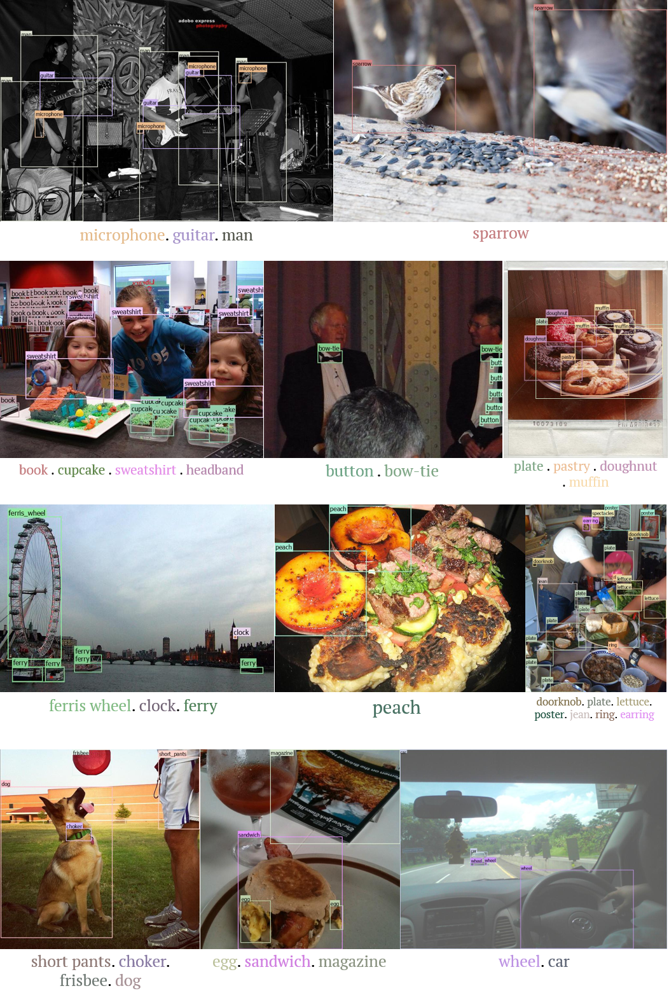
</div>

<div align="center">
  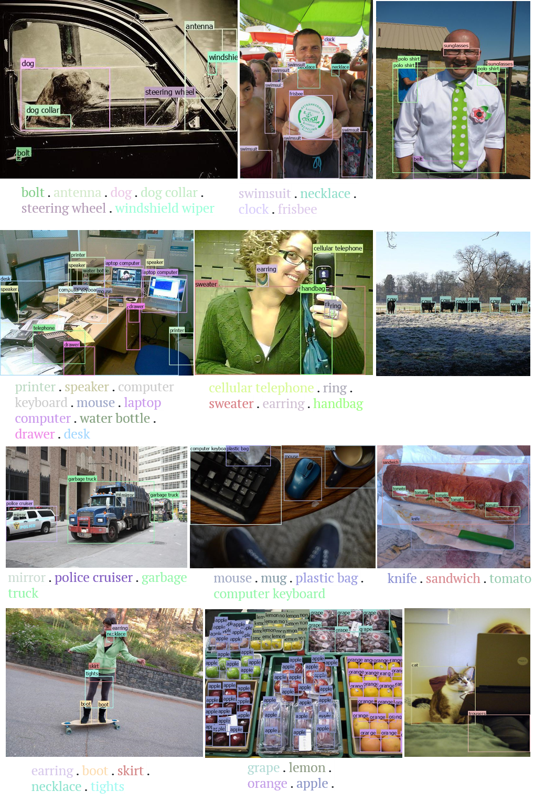
</div>

</details>

<p></p>

<details close>
<summary> <b> Long-tailed Object Detection </b> </summary>

<div align="center">
  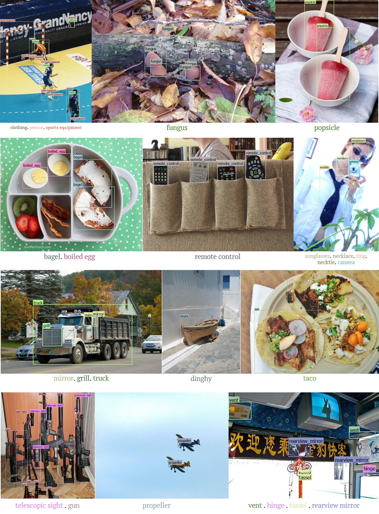
</div>

</details>

<p></p>

<details close>
<summary> <b> Short Caption Grounding </b> </summary>

<div align="center">
  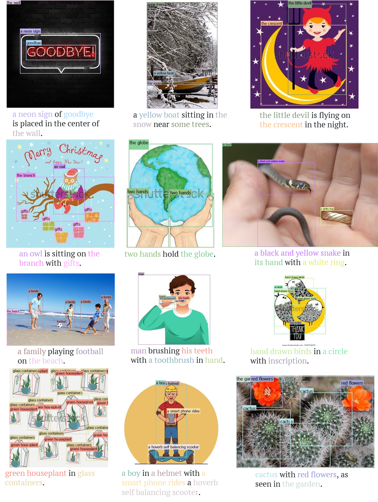
</div>

</details>

<p></p>

<details close>
<summary> <b> Long Caption Grounding </b> </summary>

<div align="center">
  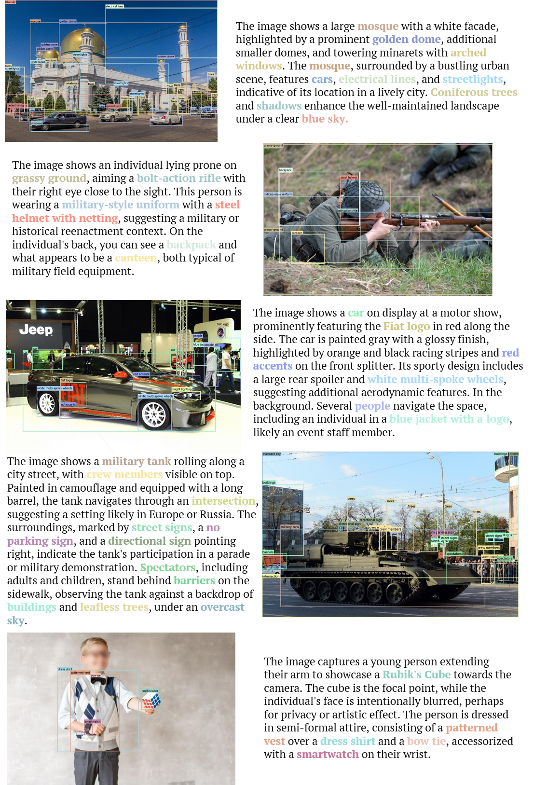
</div>

<div align="center">
  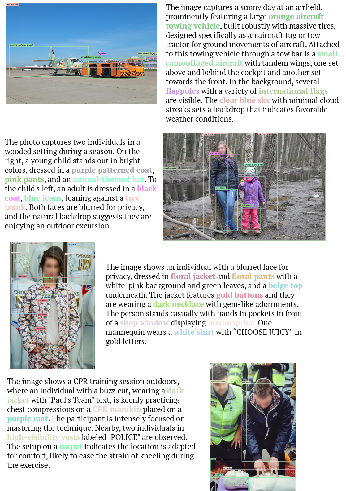
</div>

<div align="center">
  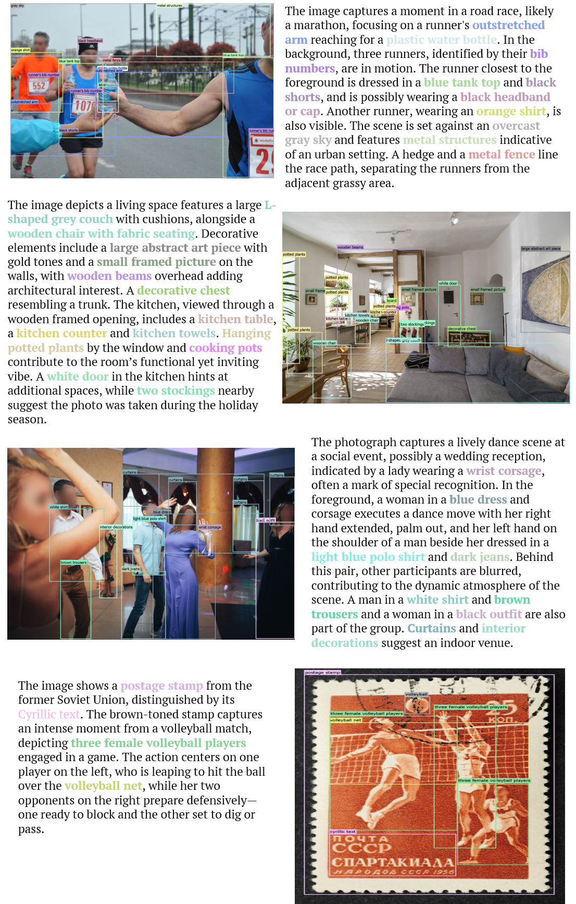
</div>

</details>

<p></p>

<details close>
<summary> <b> Dense Object Detection </b> </summary>

<div align="center">
  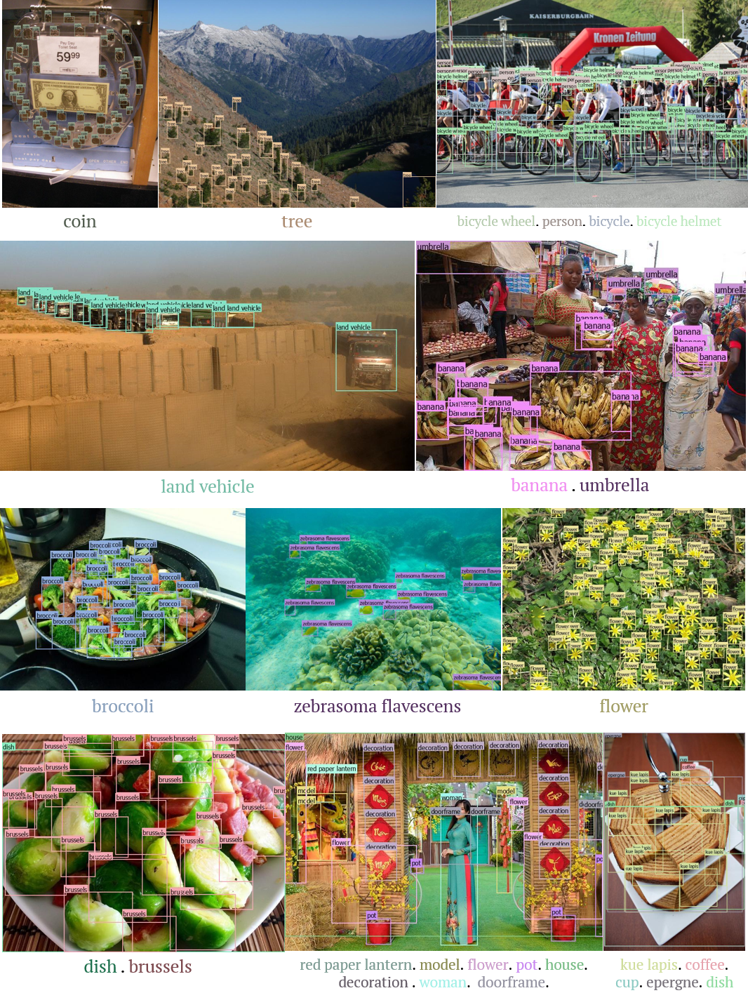
</div>

<div align="center">
  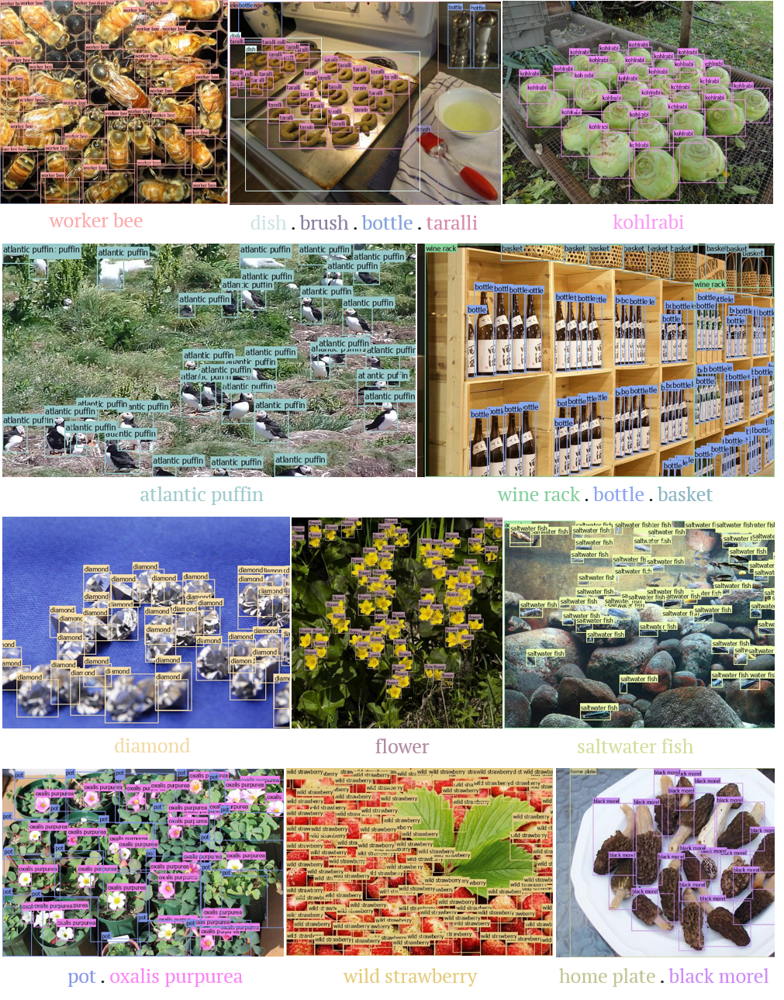
</div>

</details>

<p></p>

<details close>
<summary> <b> Video Object Detection </b> </summary>

<div align="center">
  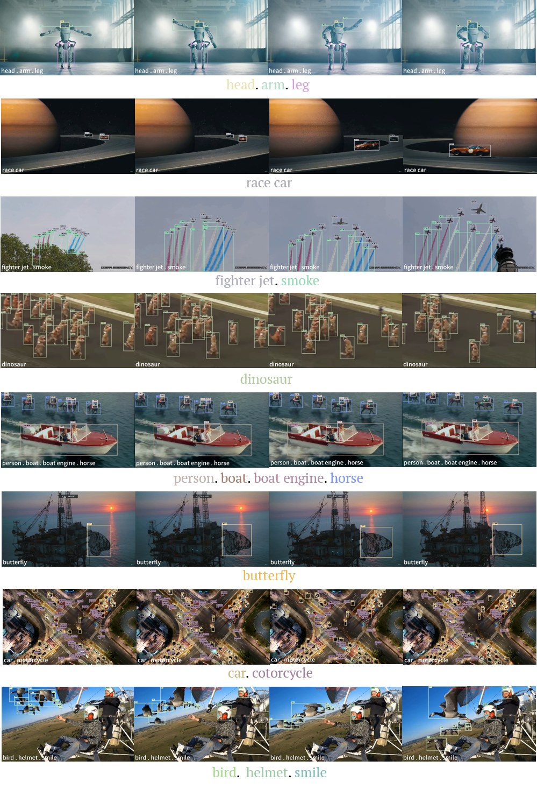
</div>

</details>

<p></p>

<details close>
<summary> <b> Advanced Object Detection on Edge Devices </b> </summary>

<div align="center">
  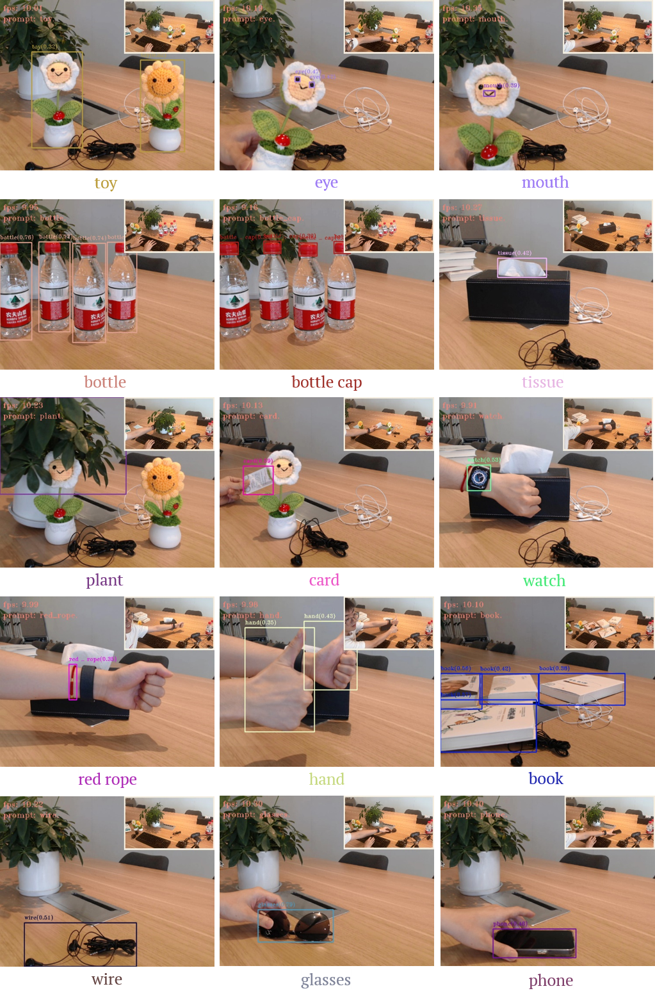
</div>

</details>

## Related Work
- [Grounding DINO](https://github.com/IDEA-Research/GroundingDINO): Strong open-set object detection model.
- [Grounded-Segment-Anything](https://github.com/IDEA-Research/Grounded-Segment-Anything): Open-set detection and segmentation model by combining Grounding DINO with SAM.
- [T-Rex/T-Rex2](https://github.com/IDEA-Research/t-rex): Generic open-set detection model supporting both text and visual prompts.

## LICENSE

<details close>
<summary> <b> Grounding DINO 1.5 API License </b> </summary>

Grounding DINO 1.5 is released under the Apache 2.0 license. Please see the [LICENSE](./LICENSE) file for more information.

Copyright (c) IDEA. All rights reserved.

Licensed under the Apache License, Version 2.0 (the "License"); you may not use these files except in compliance with the License. You may obtain a copy of the License at http://www.apache.org/licenses/LICENSE-2.0

Unless required by applicable law or agreed to in writing, software distributed under the License is distributed on an "AS IS" BASIS, WITHOUT WARRANTIES OR CONDITIONS OF ANY KIND, either express or implied. See the License for the specific language governing permissions and limitations under the License.

</details>

## BibTeX

If you find our work helpful for your research, please consider citing the following BibTeX entry.

```BibTeX
@misc{ren2024grounding,
      title={Grounding DINO 1.5: Advance the "Edge" of Open-Set Object Detection}, 
      author={Tianhe Ren and Qing Jiang and Shilong Liu and Zhaoyang Zeng and Wenlong Liu and Han Gao and Hongjie Huang and Zhengyu Ma and Xiaoke Jiang and Yihao Chen and Yuda Xiong and Hao Zhang and Feng Li and Peijun Tang and Kent Yu and Lei Zhang},
      year={2024},
      eprint={2405.10300},
      archivePrefix={arXiv},
      primaryClass={cs.CV}
}
```

```BibTeX
@misc{jiang2024trex2,
      title={T-Rex2: Towards Generic Object Detection via Text-Visual Prompt Synergy}, 
      author={Qing Jiang and Feng Li and Zhaoyang Zeng and Tianhe Ren and Shilong Liu and Lei Zhang},
      year={2024},
      eprint={2403.14610},
      archivePrefix={arXiv},
      primaryClass={cs.CV}
}
```

```BibTeX
@article{liu2023grounding,
  title={Grounding dino: Marrying dino with grounded pre-training for open-set object detection},
  author={Liu, Shilong and Zeng, Zhaoyang and Ren, Tianhe and Li, Feng and Zhang, Hao and Yang, Jie and Li, Chunyuan and Yang, Jianwei and Su, Hang and Zhu, Jun and others},
  journal={arXiv preprint arXiv:2303.05499},
  year={2023}
}
```
